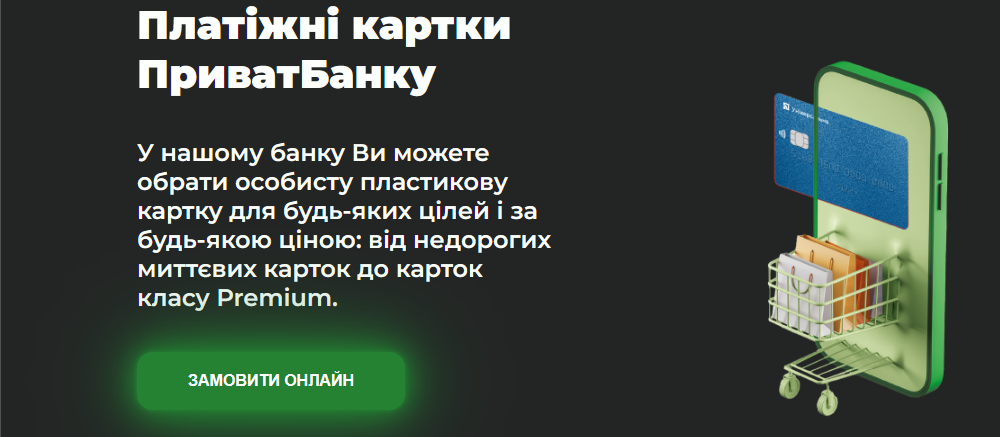
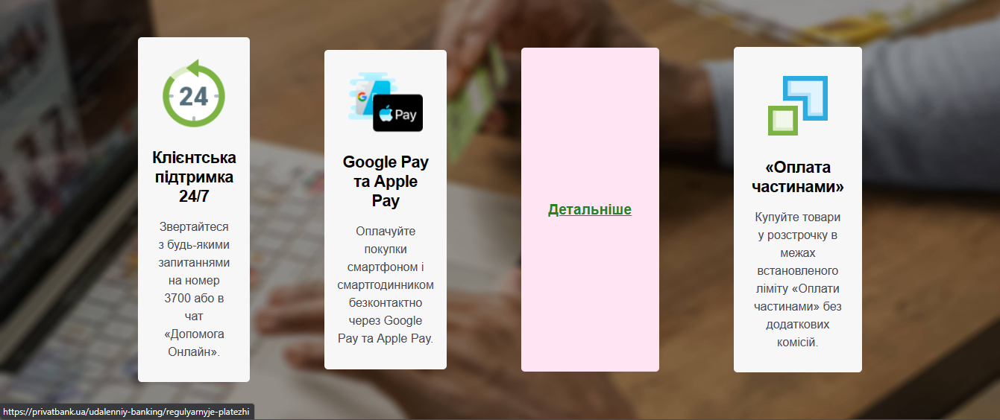
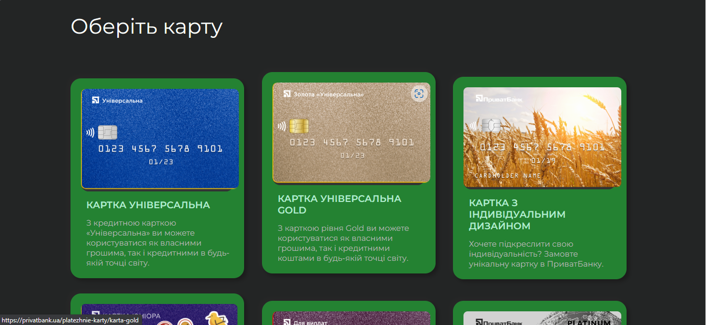
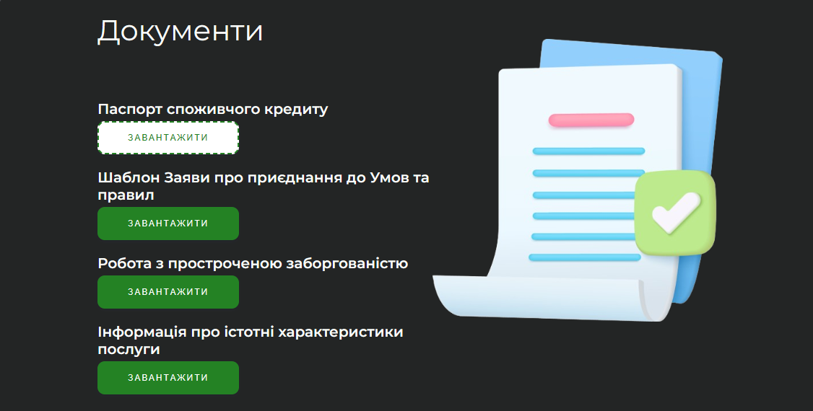
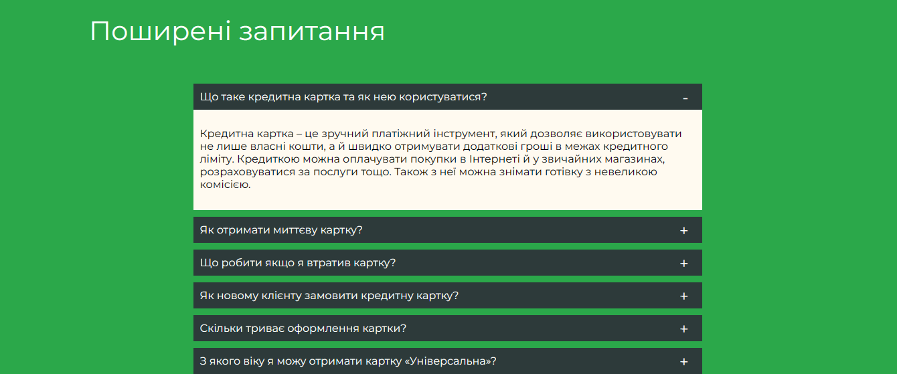
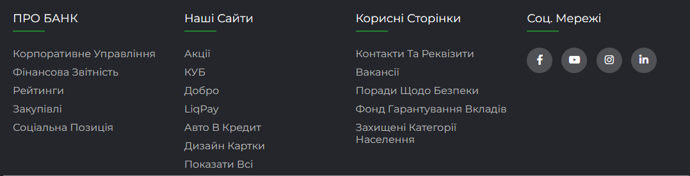

# "Розробка і супроводження програмного продукту" на тему Лендинг "Картки ПриватБанку"

Проект: *Лендинг "Картки ПриватБанку"*

Розробник: *Свинаренко Анатолій Олексійович*

## Зміст
- [Про проект](#про-проект)
- [Тестування](#тестування)
- [Інструкція з використання системи](#інструкція-з-використання-системи)
- [Вихідні коди](#вихідні-коди)

## Про проект

Проект "Лендинг "Лендинг "ПриватБанку"" був створений в рамках технологічної практики. 

### Основні вимоги до продукту

*Основними вимогами* до продукту були наявність кнопок перенаправлення користувача на офіційний веб-сайт ПриватБанку, адаптація під мобільні пристрої. 
Також замовник підкреслював важливість реалізації інтерфейсу в головних кольорах компанії. 
Сторінка має містити розділ, в якому буде представлено різні типи карток, їх зображення, назву та короткий опис. 
Лендинг має містити чітку структуру, логічно побудовані секції та блоки. 
Програмний продукт має бути зручним у використанні.

**Основні прецеденти розробленого продукту:**
- перегляд інформації про картки;
- замовлення картки онлайн;
- перегляд інформації про банк;
- перегляд питань та відповідей;
- навігація на інші сайти банку;
- перехід на соціальні мережі банку;
- доступ до документів;

Посилання на [діаграму прецендентів](https://github.com/AnatoliySv17/cardsPrivatBank/blob/main/images/docs/%D0%B4%D1%96%D0%B0%D0%B3%D1%80%D0%B0%D0%BC%D0%B0_%D0%BF%D1%80%D0%B5%D1%86%D0%B5%D0%B4%D0%B5%D0%BD%D1%82%D1%96%D0%B2.png)

### Вимоги до інтерфейсу

Значну частину роботи по розробці UI/UX-дизайну було реалізовано за допомогою Figma. На цій платформі є практично все необхідне для роботи з графікою, векторними об’єктами, шрифтами, ефектами і т.д. 

Було створено початковий макет, прототип інтерфейсу продукту.

Посилання на зображення [макет-прототип](https://github.com/AnatoliySv17/cardsPrivatBank/blob/main/images/docs/%D0%BC%D0%B0%D0%BA%D0%B5%D1%82.png)

### Архітектура системи

Веб-сторінка містить логічно побудовані блоки та секції, має чітку структуру.  Побудову системи було виконано за допомогою елементів HTML, CSS за допомогою яких було побудовано структуру веб-сайту, та стилізувати елементи. Крім того були використані скрипти JavaScript для написання функціональної частини продукту.
Ключовими компонентами та підсистемами продукту є:
- HTML – створення розмітки та структури сторінки;
- CSS – візуальна презентація сторінки;
- JS – функціональна взаємодія елементів сторінки;

Посилання на [діаграму класів](https://github.com/AnatoliySv17/cardsPrivatBank/blob/main/images/docs/%D0%B4%D1%96%D0%B0%D0%B3%D1%80%D0%B0%D0%BC%D0%B0_%D0%BA%D0%BB%D0%B0%D1%81%D1%96%D0%B2.png)

Взаємодія елементів сторінки зображена за допомогою діаграми.

Посилання на [діаграму взаємодії елементів сторінки](https://github.com/AnatoliySv17/cardsPrivatBank/blob/main/images/docs/%D0%B4%D1%96%D0%B0%D0%B3%D1%80%D0%B0%D0%BC%D0%B0__%D0%B2%D0%B7%D0%B0%D1%94%D0%BC%D0%BE%D0%B4%D1%96%D1%8F.png)

## Тестування

Тестування продуктивності - тестування, що перевіряє, чи працює сайт при певному навантаженні та відповідає вимогам щодо швидкості та продуктивності. 

Для цього тестування було використано сервіс GTmetrix.

GTmetrix - тестування, що перевіряє, чи сумісний програмний продукт з різними операційними системами та апаратними засобами.

На тестуванні продуктивності сайт показав себе дуже. Завантаження сторінки було за 0.3-0.5 секунди, що є дуже гарним результатом.

Тестування сумісності - тестування, що перевіряє, чи сумісний програмний продукт з різними операційними системами та апаратними засобами. Було використано BrowserStack.

BrowserStack - інструмент хмарних тестів, який дозволяє тестувати веб-сайти та додатки на різних платформах та пристроях, включаючи настільні ПК, планшети та мобільні телефони.

В процесі тестування сайт було перевірено в різних браузерах: Microsoft Edge, Google Chrome, Opera, Mozilla Firefox. Такожж були проведені тести мобільних версій на операційних системах Android і IOS. За результатом тестування ніяких помилок не виявлено.

Додатково було виконано перевірку доступності і часу відповіді за допомогою сервісу моніторингу аптайму Alerta та перевірку верстки та валідності лендингу за допомогою сервісу W3C Markup Validation.

Посилання на [результати перевірки доступності і часу відповіді](https://github.com/AnatoliySv17/cardsPrivatBank/blob/main/images/docs/%D1%80%D0%B5%D0%B7%D1%83%D0%BB%D1%8C%D1%82%D0%B0%D1%821.jpg)

Посилання на [результати перевірки верстки та валідності лендингу](https://github.com/AnatoliySv17/cardsPrivatBank/blob/main/images/docs/%D1%80%D0%B5%D0%B7%D1%83%D0%BB%D1%8C%D1%82%D0%B0%D1%822.jpg)

## Інструкція з використання системи

Для того, щоб потрапити на сайт потрібно скористатися посиланням - https://anatoliysv17.github.io/cardsPrivatBank/ .

При кнопок навігаційного меню користувач може переходити на інші сторінки банку, такі як «Про банк», «Тарифи», «Підтримка»


Скориставшись кнопкою «Замовити онлайн» користувач буде викликано перехід на сторінку замовлення картки.



При наведенні на картки з’являється посилання «Детальніше», перейшовши за яким користувач зможе отримати більш детальну інформацію, щодо обраної послуги.


Користувач може переглядати інформацію про різні види карток, їх зображення та опис. Натискання на картку викличе перехід на сторінку з деталями про конкретний тип картки.



Користувач має змогу завантажувати різні документи, такі як паспорт споживчого кредиту, заяву про приєднання до умов та правил тощо., скориставшись кнопкою «ЗАВАНТАЖИТИ» 



Перегляд питань та відповідей відбувається шляхом натискання на рядок з питанням, яке цікаве користувачу. Після чого він побачить відповідь на нього.



За посиланнями «підвалу» сайту користувач має змогу переходити на інші сайти ПриватБанку, на сторінки банку в соц. мережах і тд.



## Вихідні коди

Посилання на [файл index.html](https://github.com/AnatoliySv17/cardsPrivatBank/blob/main/index.html)

Посилання на [файл style.css](https://github.com/AnatoliySv17/cardsPrivatBank/blob/main/styles.css)

```
<script>
           const accordion = document.getElementsByClassName
           ('contentBx')
    
           for (i=0; i<accordion.length; i++){
           accordion[i].addEventListener('click', function() {
           this.classList.toggle('active')
       })
   }
        </script>
    <div class="container">
        <h2>Поширені запитання</h2>
    <div class="accordion">
        <div class="contentBx">
            <div class="label">Що таке кредитна картка та як нею користуватися?</div>
            <div class="content">
                <p>Кредитна картка – це зручний платіжний інструмент, який дозволяє використовувати не лише власні кошти, а й швидко отримувати додаткові гроші в межах кредитного ліміту.
                Кредиткою можна оплачувати покупки в Інтернеті й у звичайних магазинах, розраховуватися за послуги тощо. Також з неї можна знімати готівку з невеликою комісією.</p>
            </div>
        </div>
        <div class="contentBx">
            <div class="label">Як отримати миттєву картку?</div>
            <div class="content">
                <p>Вам необхiдно звернутися до найближчого вiддiлення. Для отримання картки достатньо пред'явити паспорт. Процедура оформлення картки займе у Вас всього 15 хвилин.</p>
            </div>
        </div>
```
